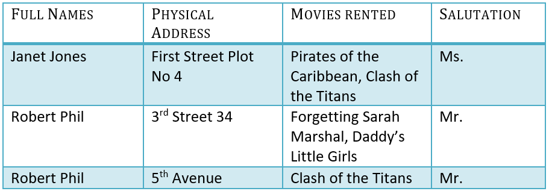
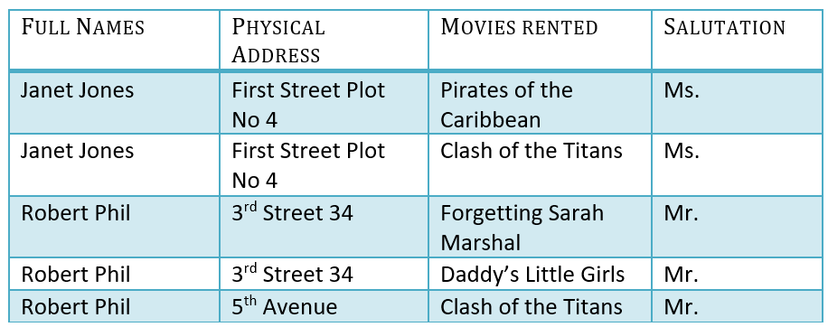
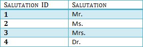

# Database Normalization

## Normalization
- a database design technique that reduces data redundancy and eliminates operation anomalies
- Edgar Codd
  - inventor of relational model
  - proposed theory of normalization with First Normal Form
  - later extended to 2nd and 3rd normal form
  - later joined **Raymond Boyce** to develope Boyce-Codd Normal Form

## My questions
- How will normalization help formalize the technique of reducing data redudancy?
- What's the difference between normal forms?

## Database Normal forms
- 1NF (First Normal Form)
- 2NF (Second Normal Form)
- 3NF (Third Normal Form)
- BCNF (Boyce-Codd Normal Form)
- 4NF (Fourth Normal Form)
- 5NF (Fifth Normal Form)
- 6NF (Sixth Normal Form)

In most practical applications, normalization achieves its best in **3rd Normal Form.**

## Example
- Assume a video library that maintais a db of movies rented out
- Without any normalization, all information is stored in 1 tables

### 1NF First Normal Form
- Each table cell should contain a single value
- Each record needs to be unique
- 1NF Example

### 2NF (Second Normal Form)
- Applies to relations with composite keys
- Rules
  1. Be in 1NF
  2. Relation must not contain any partial dependency
      - (A) no **non-prime attribute** is dependent on (B) any proper **subset of any candidate key** on the table
      - other explanation: single Column Primary Key that does not functionally dependant on any subset of candidate key relation

- Given
    - F - Full Name
    - P - Physical address
    - S - Salutation
    - M - Movies Rented
- Note that:
  - F -> S [F determines S]
  - FPS -> M [F, P, and S together determines M]
- (Refer to A)
  - M would be a **non-prime attribute**, as it does not belong to the only candidate key (candidate key is a type of field in a rdb that can identify each record uniquely)
- (Refer to B)
  - But, FPS -> M, Movies Rented is dependent on Full Name, Physical Address, and Salutation, which is a **proper subset of the candidate key**.
- Since
  - Non-prime attribute Movies Rented is dependent on a proper subset of the candidate key, which is a partial dependency and so **this relation is not in 2NF.**

- To convert the above relation to 2NF, we partition the table and introduce a new column Membership_id

### 3NF (Third Normal Form)
- Rules
  1. Be in 2NF
  2. Has no transitive functional dependencies (where a non-key column might change another non-key column)
- Given
  - Considering that changing the **non-key column** full name may change salutation, this relation is not in 3NF

- To convert the above relation to 3NF, we add a new table which stores Salutations

## BCNF (Boyce-Codd Normal Form)
- Even when a database is in 3NF, still there would be anomalies resulted if it has more than 1 candidate key
- Sometimes BCNF is referred as 3.5 Normal Form

## 4NF
- If no database table instance contains two or more, independent and multivalued data describing the relevant entity, then it is in 4th Normal Form.

## 5NF
- A table is in 5th Normal Form only if it is in 4NF and it cannot be decomposed into any number of smaller tables without loss of data

## Terms to Note
- Primary Key
  - can't be null
  - unique
  - RARELY changed
  - given to a record when inserted to the table
- Composite Key
  - a primary key composed of multiple columns (Ex. name + address: can be used to identify a record uniquely)
- Foreign Key
- Candidate key
- Non-prime attribute
- Transitive Functional Dependencies
  - is when changing a non-key column might cause any of the other non-key columns to change
- Record
  - a row of data on the database

## Reference
- [guru99](https://www.guru99.com/database-normalization.html)
- [geeksforgeeks](https://www.geeksforgeeks.org/second-normal-form-2nf/)