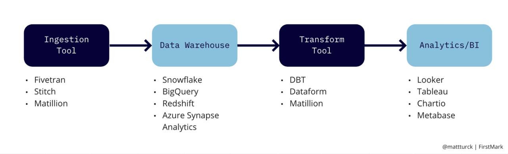
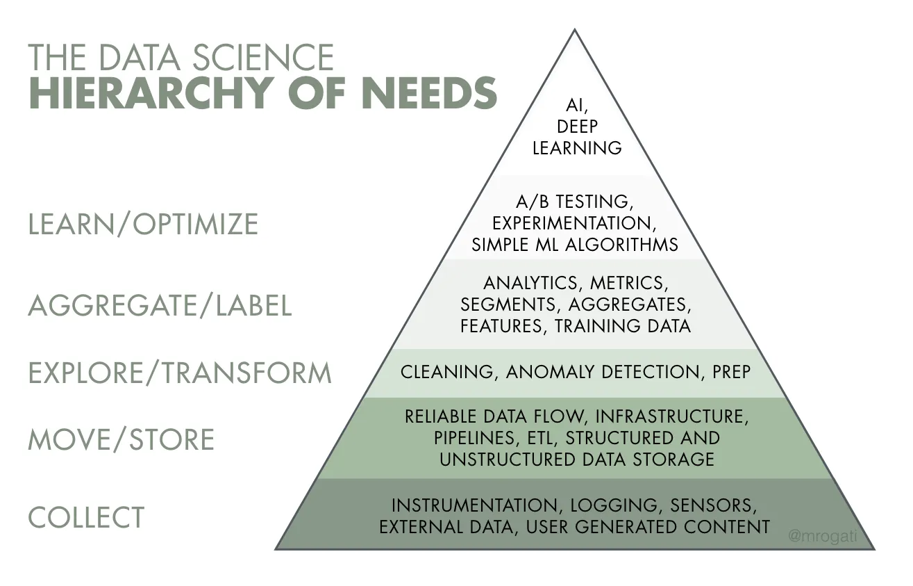

# Fundamentals of Data Engineering

The following are my notes on the book "Fundamentals of Data Engineering"
- [Fundamentals of Data Engineering](#fundamentals-of-data-engineering)
  - [Introduction](#introduction)
  - [Preface Thoughts](#preface-thoughts)
- [Chapter 1](#chapter-1)
  - [Evolution of Data Engineer](#evolution-of-data-engineer)
  - [Data Engineering and Data Science](#data-engineering-and-data-science)
  - [Data Engineering Skills and Activities](#data-engineering-skills-and-activities)
  - [Data Maturity and the Data Engineer](#data-maturity-and-the-data-engineer)
  - [Background and Skills of a Data Engineer](#background-and-skills-of-a-data-engineer)
  - [Business Responsibilites](#business-responsibilites)
  - [Technical Responsibilites](#technical-responsibilites)
    - [Types of Data Engineers](#types-of-data-engineers)
  - [Internal-Facing Vs External-Facing Data Engineers](#internal-facing-vs-external-facing-data-engineers)
  - [Terms](#terms)

## Introduction

This book covers the fundamentals of data engineering, from it's definition and life cycle to it's core architecural concepts and security. The author discusses the fundamenals in general terms such that it would be applicable to any technology you would like to utilize for your project.

What did the preface tell me?

- The heart of the book is the data engineering life cycle; the other chapters support it. Connect the dots of the end-to-end data life cycle; how to stitch together various technologies to serve the needs of downstream data consumers (data scientists, analysts, machine learning engineers) best practices is taught to at every stage of the data life cycle
- The reason why specific technologies, tools, and platforms are not explained in depth in the book is because the authors didn't want to write a book with short shelf life.
- Cloud first approach. The authors view cloud as a 'fundamentally transformative development' that will endure for decades

- The authors jokingle refer to themselves as recovering data scientists because of their struggles to execute data science products because of their lack of data engineering foundation. A big chunk of data science involves data and yet, very often, are data science talents not trained to address a lot of data tasks like data collection, data cleansing, data access, data transformation, and data infrastructure. I do agree with this as often times in school, because of the short time provided for a certain term (time constraints), most of the times the data provided in an assignment/ project are often already cleaned or at least organized in a way that these steps are skipped.

## Preface Thoughts

Data engineering is an essential process in implementing a data science solution. Yet, oftentimes it would be an afterthought when we take our data science classes due to the lack of time. This was the case when I was in the university. It's kind of relatable to know that the authors referred to themselves as *recovering data scientists* because of their struggles to execute data science products because of their lack of data engineering foundation. Now, hopefully, instructors and professors take more time to purposely teach how to do data engineering tasks so that no more student would face the same struggles.

As mentioned in my book introduction, the authors wrote the fundamentals in general terms so that the book would have a longer shelf life than technology-focused books. With this said, the author still do talk about certain technologies, all of which are cloud-first approach, but not just in depth. They introduce these technologies because they view cloud as a 'fundamentally transformative development' that will endure for decades. Stepping back from the specific tools and technologies, the authors emphasized that the heart of the book is the data engineering life cycle as the other chapters support it. Through this overview, the author wishes the reader to learn how to connect the dots of end-to-end data life cycle, stitch together various technologies to serve the needs of downstream data consumers, and implement the best practices at every stage of teh data life cycle.

# Chapter 1

- Data engineering sharing the same stage with data science
- Parts
  - how the field was born and its evolution
  - skills of data engineers
  - whom they work

The authors define data engineering as follow:

> Data engineering is the development, implementation, and maintenance of systems and process that take in raw data and produce high-quality, consistent information that supports downstream use cases, such as analysis and machine learning. Data engineering is the intersection of security, data management, DataOps, data architecture, orchestration, and software engineering. A data engineer manages tha data engineering lifecycle, beginning with getting data form source systems and ending with serving data for use cases, such as analysis or machine learning.

What a beautiful and concise definition that is.

- Stages of data engineering lifecycle
   Screenshot from the book
  - Generation
  - Storage
  - Ingestion
  - Transformation
  - Serving
- Undercurrents - critical ideas across the entire lifecycle
  - Security
  - Data management
  - DataOps
  - Data architecture
  - Orchestration
  - Software engineering

## Evolution of Data Engineer

- 1980 - 2000
  - Bill Inmon coining data warehoue in 1989
  - IBM developed the relational database and Structured Query Language (SQL)
  - Oracle popularized the tech (relational db; SQL)
- Early 2000s birth of contemporry data engineering
  - Big data three V's
    - velocity
    - variety
    - volume
  - Yahoo developed the open source Apache Hadoop
- The 2000s and 2010s Big data engineering
  - List of tools
    - Hadoop
    - Apache Pig
    - Apache Hive
    - Dremel
    - Apache HBase
    - Apache Storm
    - Apache Cassandra
    - Apache Spark
    - Presto
  - Big data is essentially a relic to describe a particular time and approach to handling large amounts of data
  - Big data engineers are now simple data engineers
- The 2020s: Engineering for the data lifecycle
  - Before: low-level details of monolithic frameworks such as Hadoop, Spark, or Informatica
  - Today: trend is moving toward decentralized, modularized, managed, and highly abstracted tools
  - Modern Data Stack
    - representing a collection of off-the-shelf open source and third-party products assembled to make analysts' lives easier
    - Data Engineering is increasingle a discipline of interoperation, and connecting various technologies like LEGO bricks, to serve ultimate business goals
         *screenshot from Matt Turck's website*
  - Data engineer discussed in the book can be described more precisely as a data lifecycle engineer
    - Low-level data programming
    - High-level
      - Security
      - data management
      - Data Ops
      - Data architecture
      - Orchestration
      - General data lifecycle management
  - Data Engineers
    - CCPA
    - GDPR
    - compliance with regulations
- Present
  - golden age of data lifecycle management

## Data Engineering and Data Science

- Authors believe that data engineering is separate from data science and analytics
  
- Data Engineering - upstream
- Data Science - downstream

## Data Engineering Skills and Activities

- Balancing act of data engineering
  - Cost
  - Agility
  - Scalability
  - Simplicity
  - Reuse
  - Interoperability
  
## Data Maturity and the Data Engineer

- Data maturity is the progression toward higher data utilization, capabilities, and integration across the organization
- There are many versions/models of data maturity (ex. Data Management Maturity DMM)
- Simplified Data Maturity Model (created by the authors):
    1. Starting with data
        - Early stages of data
        - Data Engineer is usually a generalist and will typically play several other roles such as data scientist or software engineer
        - adhoc data requests; not recommended to jumpfirst to ML in the early stages without building a solid foundation
        - Data Engineer's focus:
          - Get buy-in from key stakeholders; have a sponsor for critical initiatives to design and build a data architecture to support company's goals
          - Define right data architecture that works towards the company's business goals
          - identify and audit data that will support key initiatives and operate within the data architecture you desinged
          - build a soid data foundation for future data analysts and data scientists to generate reports and models that provide competitive value
        - Pitfall tips:
          - Get quick wins but at the same time be wary of technical debt. Quick wins help organizational willpower not wane when visible success don't occur with data
          - Get out and talk to people in order to create thigns that are of actual use to them
          - When the off-the-shelf solution already exists, try these whenever possible and do not box self from unnecessary technicaly complexity
          - Building custom solutions and code only where this creates a competitive advantage
    2. Scaling with data
        - When company has moved away from ad hoc data requests and has formal data practices
        - Data engineering roles move from generalists to specialists
        - Data Engineer's goals:
          - Establish formal data practices
          - Create scalabale and robust data architectures
          - Adopt DevOps and DataOps practices
          - Build systems that support ML
          - Continue to avoid undifferentiated heavy lifting and customize only when a competitive advantage results
        - Issues to watch out for:
          - Temptation to adopt bleeding-edge technologies. These are rarely a good use of your time and energy
          - Main bottleneck for scaling is not technology itself, but the data engineering team. Focus on solutions that are simple to deploy and manage to expand your team's throughput
          - Instead of being a technologist/data genius who can deliver magical products. Shift focus to pracmatic leadership and begin transitioning to the next maturity stage; communicate with other teams about the pracical utility of data. Teach the organization how to consume and leverage data
    3. Leading with data
        - Company is data-driven
        - automated pipelines and systems created by data engineers allow the people within the company to do self-service analytics and ML
        - Data Engineer goals:
          - Maintion prior stages
          - Create automation for the seamless introduction and usage of new data
          - Focus on building custom tools and systems that leverage data as a competitive advantage
          - Focus on data governance, data quality, and DataOps (Enterprisey Aspects of Data)
          - Deploy tools that expose and disseminate data throughout the organization, including data catalogs, data lineage tools, and metadata management systems
          - Collaborate efficiently with other roles (ex. software engineers, ML people, etc)
          - Create an open community to discuss/collaborate
        - Issues to watch out for:
          - Complacency for which one can fallback to the previous stage
          - Emphasis again on the custom-built technology that OFFERS value/ competitive advantage

## Background and Skills of a Data Engineer

- Transition is easiest when moving from an adjacent field like:
  - software engineering
  - ETL development
  - database administration
  - data science
  - data analysis
- Data Engineer
  - must understand both data and technology
  - W/ respect to data - must know best practices around data management
  - W/ respect to technology - must be aware of various options for tools, their interplay, and their trade-offs
  - must understand data consumers (data analysts and data scientist)

## Business Responsibilites

- Know how to communicate with non-technical and technical people
- Understand how to scope and gather business and product requirements
- Understand the cultural foundations of Agile, DevOps, and DataOps
- Control costs
- Learn continuously

## Technical Responsibilites

- must understand how to build architectures that optimize performance and cost at a high level, using prepackaged or homegrown components
- Data Engineers remain software engineers, in addition to their many other roles

- Primary languages of data engineering
  - SQL
    - learn sql modern semantics for dealing with Javascript object notation (JSON)
  - Python
  - Java Virtual Machine (Java or Scala)
  - bash

### Types of Data Engineers

1. Type A data engineer
    - abstraction
    - keeps data architecture as abstract and straightforward as possible and not reiventing the wheel
2. Type B data engineer
    - build
    - build data tools and systems that scale and leverage a company's core competency and competitive advantagae

## Internal-Facing Vs External-Facing Data Engineers

1. External-facing data engineer
    - Aligns with the users of exernal-facing application like social media apps, IoT devices, eccomerce platforms
    - architects, build, and manages the system that collect, store, and process transactional and event data from these apps
    - external-facing query engines often handle much larger concurrency loads than internal-facing systems
    - tighter query parameters for these
2. Internal-facing data engineer
   1. creating and maintaining data pipelines and data warehouses for BI dasbaords, reports, business, processes, data science, and ML models

## Terms

- Mapreduce
- SQL management framework (dbt) - Data Build Tool
