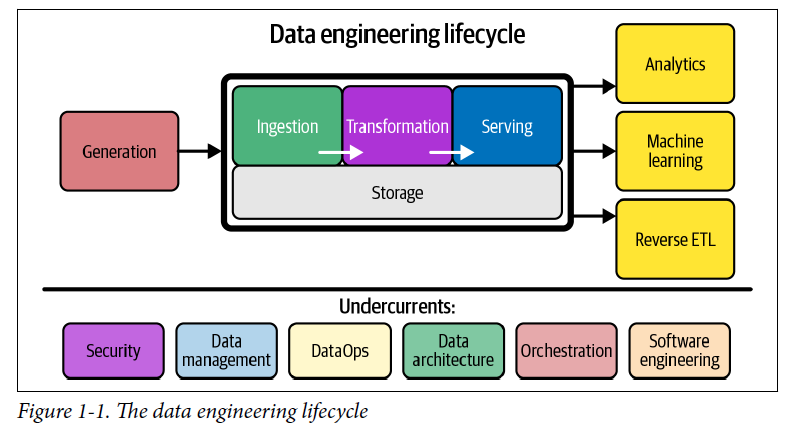

# Chapter 2: The Data Engineering Lifecycle

## What is Data Engineering Life Cycle
- Data Engineering Lifecycle stages
    1. Generation
    2. Storage
    3. Ingestion
    4. Transformation
    5. Serving Data
